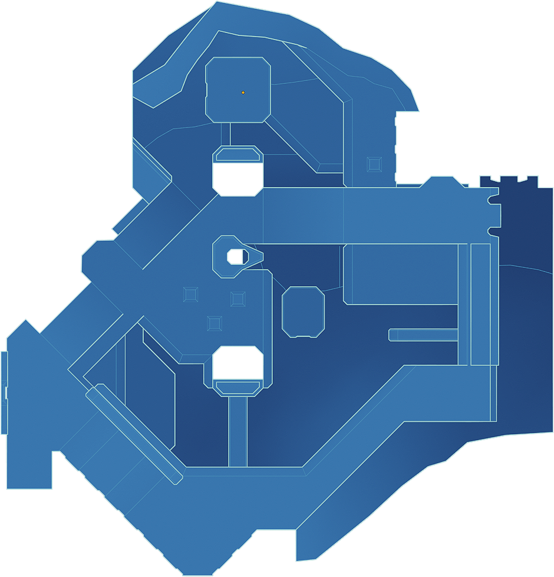

# Rock Bottom
Rock Bottom is a Halo CE multiplayer map for MCC, designed for 2v2 competitive slayer. It was created for the [Halo 1 Guide Discord Server](https://discord.gg/6HWxRzuamu) 2025 2v2 map contest. [Subscribe to this map on the Steam Workshop](https://steamcommunity.com/sharedfiles/filedetails/?id=3425312311).

Thanks to the Halo 1 Guide server judges and players for supporting this project and providing feedback!

## Building the map
Use these instructions if you need to build your own version of this map from tags.

1. A [Halo 1 MCC Mod Tools][h1ek] installation is needed to build this map.
2. Merge the tags from this repo into the mod tools' `tags` folder.
3. Copy `steamapps\common\Halo The Master Chief Collection\halo1\maps\bitmaps.map` into the mod tools `maps` folder so it can be used as a dependency.
4. [Build the map][build] with `tool build-cache-file levels\test\rock_bottom\rock_bottom classic read`.

You should now have a built map at `maps/rock_bottom.map`.

If you need to re-run lightmaps, the included lightmaps were run with radiosity parameters: `1 0.01`.

## Assets
Source assets are found in this repo's `data` folder. Merge these into your mod tools' `data` folder if you wish to make changes and rebuild tags.

Texture sources are `.kra` files for the free 2D software [Krita][krita]. When exporting the associated `.tif` files, use the [Save Merged method][krita-usage]. The `bitmaps_ref` folder just contains Blender reference textures for the game's stock shaders.

The BSP was modeled in [Blender 4.3][blender] and exported to JMS using [General_101's Toolset][toolset].

## License
This map and its sources are shared under CC BY-NC 4.0. Feel free to remix or redistribute for any purpose as long as there's attribution and your derivatives are non-commercial.

[h1ek]: https://c20.reclaimers.net/general/mod-tools/#installation
[build]: https://c20.reclaimers.net/h1/h1-ek/h1-tool/#build-cache-file
[krita]: https://krita.org/en
[krita-usage]: https://c20.reclaimers.net/general/art-tools/krita/#usage
[toolset]: https://github.com/General-101/Halo-Asset-Blender-Development-Toolset
[blender]: https://www.blender.org/
